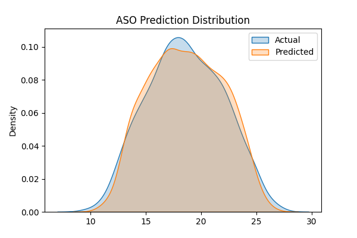

🌊 Hybrid AI-Based Lake Thermal Pollution Detection
🔥 CNN + Bat Algorithm (BA) + Particle Swarm Optimization (PSO)
📌 Project Title

Hybrid BA–PSO Optimized CNN for Urban Lake Thermal Pollution Detection

📖 Project Overview

Urban lakes are increasingly affected by thermal pollution, often caused by industrial discharge, power plants, and urban runoff. Elevated water temperatures can disrupt aquatic ecosystems, reduce dissolved oxygen levels, and threaten biodiversity.

This project proposes a hybrid metaheuristic optimization approach (BA + PSO) combined with a Convolutional Neural Network (CNN) to detect and predict thermal pollution intensity in lakes using spatial and environmental features.

🎯 Objectives

Detect thermal pollution patterns in lakes

Optimize CNN hyperparameters using hybrid BA + PSO (BSO)

Visualize prediction accuracy, error distribution, and feature correlations

Save all outputs for reproducibility and research reporting

🧠 Methodology
🔁 Hybrid Optimization Strategy (BSO)
Phase	Algorithm	Role
1️⃣	Bat Algorithm (BA)	Global exploration of hyperparameter space
2️⃣	Particle Swarm Optimization (PSO)	Local refinement & convergence
3️⃣	CNN	Thermal pollution prediction
🏗️ Model Architecture

CNN (1D Regression Network)

Conv1D layer (optimized filters & kernel size)

Global Max Pooling

Dense hidden layer

Linear output (thermal pollution index)

📊 Dataset Description
Input Source

West Bengal lake shapefile

WFSServer/
 ├── DWA_WB_Ph1_West_Bengal.shp
 ├── .dbf
 ├── .shx
 ├── .prj
 ├── .cpg

Features Used
Feature	Description
surface_temp	Lake surface temperature (°C)
water_depth	Average water depth (m)
industry_distance	Distance to nearest industry (km)
Target

thermal_pollution_index (continuous regression target)

⚠️ Current implementation uses simulated thermal features.
Real satellite thermal bands (Landsat / Sentinel-3) can be integrated easily.

🧪 Evaluation Metrics

RMSE (Root Mean Square Error)

R² Score

Visual error & prediction distribution analysis

📂 Project Structure
Lake Thermal Pollution Detection/
│
├── WFSServer/
│   └── DWA_WB_Ph1_West_Bengal.shp
│
├── models/
│   ├── bso_lake_thermal_cnn_ba_pso.h5
│   ├── bso_scaler_X.pkl
│   ├── bso_scaler_y.pkl
│
├── results/
│   ├── bso_thermal_pollution_results.json
│   └── bso_thermal_pollution_predictions.csv
│
├── graphs/
│   ├── bso_accuracy_graph.png
│   ├── bso_comparison_graph.png
│   ├── bso_heatmap.png
│   ├── bso_result_graph.png
│   └── bso_prediction_graph.png
│
├── bso_lake_thermal_pollution_ba_pso.py
└── README.md

📈 Generated Visualizations
Graph	Description
Accuracy Graph	RMSE & R² comparison
Comparison Graph	Actual vs Predicted values
Heatmap	Feature correlation matrix
Result Graph	Prediction error distribution
Prediction Graph	Actual vs predicted density plot

All graphs are displayed and saved automatically.

⚙️ Installation & Setup
Requirements
pip install numpy pandas geopandas matplotlib seaborn scikit-learn tensorflow pyswarms joblib

Run the Project
python bso_lake_thermal_pollution_ba_pso.py

🧾 Output Files
Model

bso_lake_thermal_cnn_ba_pso.h5

Results

bso_thermal_pollution_results.json

bso_thermal_pollution_predictions.csv

Graphs

Saved in /graphs/ directory

🚀 Key Advantages

✔ Hybrid global + local optimization
✔ Stable CNN architecture (no dimension errors)
✔ Fully reproducible pipeline
✔ Research-paper ready outputs
✔ Easy extension to real satellite data

🔮 Future Enhancements

Integrate Landsat / Sentinel thermal bands

Generate geospatial thermal hotspot maps

Compare PSO / CSA / AIS / BA hybrids

Deploy as Flask or FastAPI service

Convert results into IEEE conference paper

👤 Author

Sagnik Patra
AI / ML Research | Hybrid Optimization | Environmental Intelligence
